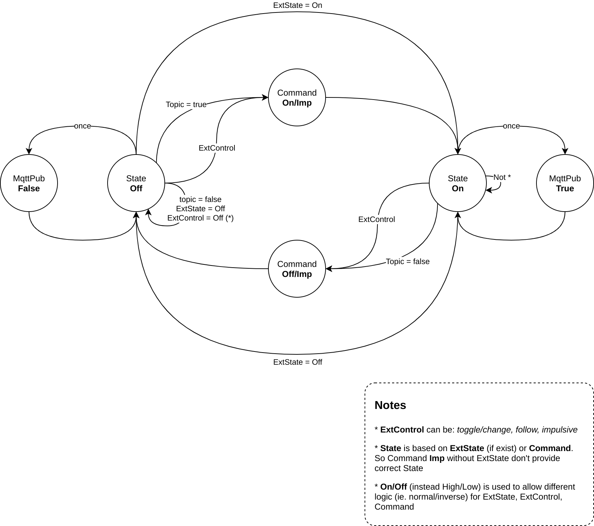

**This ESP8266 device is intended as an implementation example of [YAHNC](https://github.com/elbowz/yahnc) libs**

## SWECS
##### Switch External Control & State

SWECS is an advanced Switch made up 3 [Homie](https://github.com/homieiot/homie-esp8266) Nodes basing on [YAHNC](https://github.com/elbowz/yahnc) lib:
* `SwitchNode` aka *Command*
* `ButtonNode` aka *External Control*
* `BinarySensorNode` aka *External State* (optional)

This switch can be controlled remotely thanks to MQTT (`SwitchNode`), locally by a physical switch (`ButtonNode`) and it can use an optional *External State*, directly from the device (`BinarySensorNode`).

SWECS was designed to control the "wall light" (like Shelly or Sonoff) with a pre-existing system (bulb, switch/button, relay, wires), but can be also used for other devices (eg fans, gate...). The *External State* should be used when we can't by-pass the device main switch, and we want still use it normally.

> **tip:** In presence of a step relay and/or you are interested to device consumption (ie Ampere/Watt) see [SWECS-P](#SWECS-P)

### Getting Started

Compile and upload with [PlatformIO](https://platformio.org/):

`pio run --environment callback --target upload`

### Notes

When `EXT_STATE` (build flag) is not set, the device state is manage internally and taken it from the `SwitchNode` output, otherwise is taken from the `BinarySensorNode` and published under `/state/state` topic.

The *External Control* can be:   

0. *Toggle:* switch change => device state change
1. *Impulsive:* button push => device state change 
2. *Follow:* switch On (Off) => device state On (Off)

and can be set as `HomieSetting`: *externalControlMode*

*External Control* have some predefined "macro/gesture".  
eg hold button more than 1 second and release, set device timeout proportional to press duration (for more info see func `extControlHandler()`) 

## SWECS-P
##### Switch External Control & State - Power

Very similar to SWECS, add only two features:
* Power meter with the use of an ACS7128 (`ACS7128Node` extend `AdcNode`)
* Impulsive support for `SwitchNode` (aka *Command*), useful for step relay

### Getting Started

Compile and upload with [PlatformIO](https://platformio.org/):

`pio run --environment inheritance --target upload`

### Notes

The purpose of SWECS-P is to show a different implementation method, where instead of callback is used inheritance way.

An example is the class [AdvSwitchNode](/src/inheritance/AdvSwitchNode.h) that extends `SwitchNode` and `BinarySensorNode` through a multiple inheritance (and causing a diamond problem). Thanks to this approach we can create a single new `HomieNode` with some advantage, for example have a single topic `/switch` with a `/command` and `/state` subtopic.

> **note:** the added features can be also implemented to SWECS by "callback way". 

## State Machine diagram

